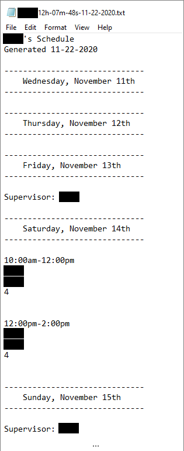

# LGCT-schedule-scraper

Utilizes Google Docs API to recursively read a specified Employee's assigned Tour and Supervisor times 
into various data structures (lists and dictionaries), which are then parsed to write only relevant information about 
the Employee's work schedule to a text document.

**Relevant information about the Employee's work schedule includes:**
* Employee is scheduled as Supervisor 
* Employee has a booked Tour(s)
* Employee has an unbooked Tour(s)
* Employee has a booked High Ropes
* Employee has an unbooked High Ropes
* Emplotee has a task assigned to them

_Note: for ease of understanding, High Ropes and Tours will both be refered to as "Tours" for the rest of this document._

# Motivation

Assigned Tours and tasks for all Employees are located in one Google Doc [Work Schedule]. This means an Employee cannot glance at 
the Work Schedule and see their hours, as they need to sift through the Tours and tasks assigned to every employee at the company. 
This application aims to fix that by scraping the Work Schedule for only a specified Employee's Tours and tasks and writing only those times to a text file.

**Current Work Schedule Example:**

_Note: Employee names removed for privacy._

# Dependencies

* [Google Docs API v1](https://developers.google.com/docs/api)
* [Pip](https://pypi.org/project/pip/) (to install Google Docs API)

# Project Setup

**Setup Google Docs API v1:**

* Reference [Google Docs API Python Quickstart Guide](https://developers.google.com/docs/api/quickstart/python) for in-depth 
instructions and troubleshooting installing the Google Docs API and generating the required credentials and tokens to use the Google Docs API.

**Setup project:**

* In `application.py`, set document ID:
~~~python
DOCUMENT_ID = "<set-document-ID-here>"
~~~

* In `writeFile.py`, set text file save path:
~~~python
PATH = "<set-text-file-save-path-here>"
~~~

_Note: this program is written to only correctly parse data gathered from Docs formatted in a very specific way. 
It is highly likely any attempt to use this program on a document not formatted like Work Schedule will fail. 
Rewritting large portions of `extractText.py` and `writeFile.py` would be required to use this program on another Doc._

# Project Files

* `extractText.py` recursively read text from the Schedule Doc into various data structures (Lists and Dictionaries containing dates, occurances of Employee, Employee work assignments, etc.)
* `writeFile.py` parses text data in data structures created in `extractText.py`, writes Employee-relevant information to text file
* `application.py` checks user's Doc API credentials, run `main` to generate file containing Employee's schedule

# Challenges

The format that data is entered into the Work Schedule is not standardized. Several individuals are responsible for 
entering information into the Work Schedule, and each does it a slightly different way.

**An Employee can be assigned as a Supervisor in several different ways:**
* Employee appears on same line as "Supervisor:"
* Employee appears on same line as "Supervisor:" with the name of a different employee
* Employee appears on line below "Supervisor:"

Additionally, the Supervisor may be unassigned, either by being blank or the work "unassigned".

Thus, several checks must be made when determining if Employee is scheduled as Supervisor.
~~~python
def create_sup_list(text):
    """
    Only writes to SupData list if sup contains employee name
    :param text: single line of paragraph content
    :return boolean if text is Supervisor
    """
    sup = 'Supervisor:'
    # check line below occurrence of sup contains employee
    if SupData.sup_line:
        if EmployeeTourData.employee in text:
            SupData.s_list.append(text)
            SupData.s_list.append(TextData.text_index)
        SupData.sup_line = False
    # finds if sup is on the same line as employee name
    elif sup in text and EmployeeTourData.employee in text:
        # add only employee name to s_list
        SupData.s_list.append(text[12:])
        SupData.s_list.append(TextData.text_index)
        SupData.sup_line = False
    elif sup in text:
        # assume name of supervisor is on next line
        SupData.sup_line = True
    else:
        # text does not contain sup, return False
        return False
    # sup in text, return True
    return True
~~~

**Employee Tours can be configured in several different ways:**
~~~
Tour Time
Employee
Amount
~~~
~~~
Tour Time
Employee
Other Employee
Amount
~~~
~~~
Tour Time
Other Employee
Employee
Amount
~~~
~~~
Tour Time
Employee
Other Employee
Other Employee
Amount
~~~
~~~
Tour Time
Other Employee
Employee
Other Employee
Amount
~~~
~~~
Tour Time
Other Employee
Other Employee
Employee
Amount
~~~

_Note: `Amount` can be an integer, a question mark, or empty space._

# Demo

Running the program will prompt the user to enter the Employee name to build the schedule for. 
After the Employee name is entered, the program will create a text file containing the Employee's schedule.

**Example Output:**

_Note: Employee name removed for privacy. A typical output file is substantially longer than the example shown above. The above example shows only the first few entries in the output file._

# Future Work

* Improve program efficiency and accuracy of writing Employee Tours to file
* Account for additional "Short Course" text under Tour time when writing Employee Tours to file
* Collect and write occurances of "No [Employee]" to file, under appropriate dates
* Add GUI to configure Employee search settings
* Write error message in file if leftover employee instances in EmployeeTourData

# Credits

Google Docs API [Extract the text from a document](https://developers.google.com/docs/api/samples/extract-text#python) sample used to recursively visit each structural element in a Doc.

